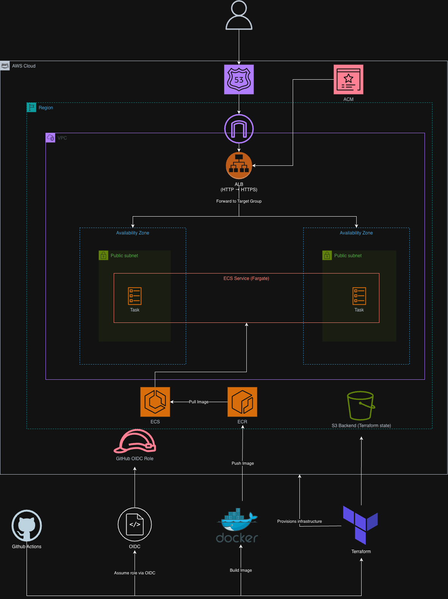
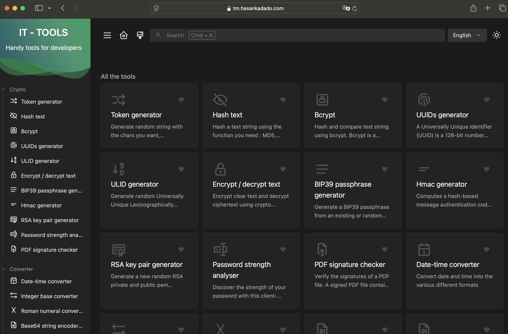
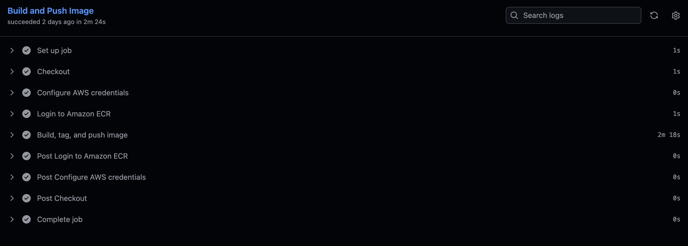

# IT Tools Deployment (AWS + Terraform + CI/CD)

## Overview

This project deploys a containerized web application (IT Tools) on AWS ECS (Fargate) using scalable, production-style infrastructure.

It implements secure best practices including HTTPS via ALB + ACM, IAM roles, and non-root container execution.

Infrastructure is fully managed with Terraform, while a GitHub Actions CI/CD pipeline automates image builds, deployments, and updates.

---

## Features

- Infrastructure as Code using Terraform (VPC, ECS, ALB, ECR, ACM, Route53)
- CI/CD pipeline with GitHub Actions
- Secure AWS authentication via OIDC (no long-lived credentials)
- Dockerized application deployed on ECS Fargate
- HTTPS enabled via ACM + ALB
- Remote Terraform state stored in S3
- Multi-AZ deployment for high availability

---

## Architecture



---

## Architecture Overview

- Route53 routes user traffic to the Application Load Balancer (ALB)
- ALB terminates HTTPS (ACM) and forwards requests to ECS tasks
- ECS Fargate runs the application across multiple availability zones
- ECS tasks pull container images from Amazon ECR
- Terraform provisions and manages all AWS infrastructure
- Terraform state is stored remotely in S3
- GitHub Actions handles CI/CD:
  - Builds Docker image
  - Pushes to ECR
  - Runs Terraform (plan/apply)
- Authentication to AWS is handled via OIDC and IAM role assumption

---

## CI/CD Pipeline

1. Push to `main` triggers GitHub Actions
2. Workflow authenticates to AWS via OIDC
3. Docker image is built and tagged with commit SHA
4. Image is pushed to Amazon ECR
5. Terraform runs:
   - fmt
   - validate
   - plan
   - apply
6. ECS service deploys updated container
7. Health check verifies deployment

---

## Live Application

https://tm.hasankadado.com

---

## Deployment Proof

### Application Running



### CI/CD Pipeline



---

## Tech Stack

- AWS (ECS, Fargate, ALB, ECR, Route53, ACM, S3, IAM)
- Terraform
- Docker
- GitHub Actions
- Node.js / Express

---

## Local Development

```bash
pnpm install
pnpm build
node server.js
```

Visit http://localhost:8080/

## Credits

This project deploys the open-source IT Tools application:
https://github.com/CorentinTh/it-tools
